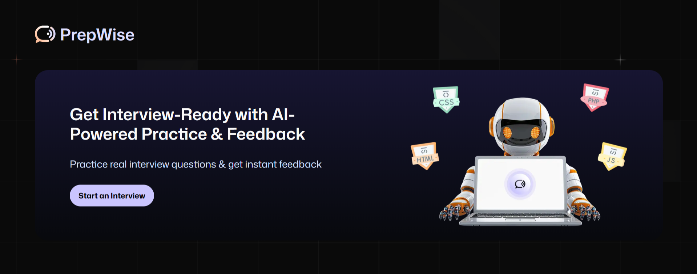

#  PrepWise - Mock Interview Platform

**PrepWise** is an innovative platform that helps users prepare for interviews by offering mock interview sessions with personalized questions. The website provides users with the ability to generate interview questions based on their preferences, take mock interviews, and receive feedback, all through voice calls.

## Homepage Screenshot

## Features

- **Generate Custom Interview Questions**: Users can generate a set of personalized questions based on the role or interview type they want to practice for, using Gemini AI.
- **Voice Call Mock Interviews**: The entire mock interview process is conducted through voice calls, providing users with a realistic interview experience.

- **Real-time Feedback**: After completing a mock interview, users will receive feedback based on their performance. Gemini AI analyzes the responses and provides suggestions on areas for improvement.

- **User Authentication**: The platform supports registration, login, and logout functionality, allowing users to manage their profiles and mock interview sessions.

## Tech Stack

- **Gemini AI**: Used for generating custom interview questions based on user input.
- **VAPI**: Used for voice call functionality, enabling real-time communication during mock interviews.
- **Firebase**: Used for user authentication (sign-up, login, logout).
- **Next.js**: The framework for building the website.
- **Tailwind CSS**: Used for styling the website.

## Live Demo

You can access the live version of the project here:

[**Live Site: PrepWise - Mock Interview Platform**](https://prepwise-sigma.vercel.app)

## How it Works

1. **Sign Up/Log In**: Users sign up or log in to their accounts to start using the platform.
2. **Generate Interview Questions**: After logging in, users can generate interview questions based on the role they want to practice for.

3. **Voice Call Mock Interview**: Once the questions are generated, users can initiate a mock interview session where they will answer questions via voice call.

4. **Feedback**: After completing the mock interview, Gemini AI provides feedback on the user's performance, highlighting areas of improvement.

## Future Features

- **Advanced Analytics**: Provide users with detailed analytics on their interview performance over time.
- **Multiple Interview Formats**: Support for different interview formats like coding interviews, behavioral interviews, etc.
- **Live Interview Coaching**: Ability for users to interact with real interview coaches in real-time.

## Contributing

We welcome contributions to this project. If you'd like to contribute, feel free to fork the repo and submit a pull request with your improvements or bug fixes.

### Steps to contribute:

1. Fork the repository
2. Create a new branch (`git checkout -b feature-branch`)
3. Make your changes
4. Commit your changes (`git commit -am 'Add feature'`)
5. Push to the branch (`git push origin feature-branch`)
6. Create a new Pull Request

## License

This project is licensed under the MIT License - see the [LICENSE](LICENSE) file for details.

---

Thank you for using **PrepWise**! We hope it helps you prepare for your next big interview!
